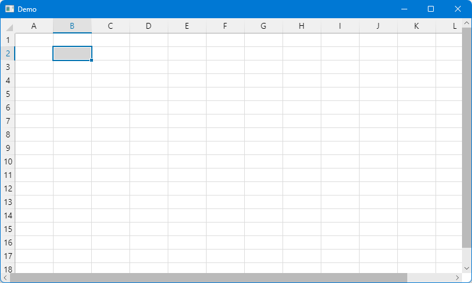

# Spreadalonia: a spreadsheet control for Avalonia


[](https://www.gnu.org/licenses/lgpl-3.0)
[](https://nuget.org/packages/Spreadalonia)

**Spreadalonia** is a library providing a simple spreadsheet control for Avalonia, with support for some basic features.

The library is released under the [LGPLv3](https://www.gnu.org/licenses/lgpl-3.0.html) licence.

<p align="center">
    
</p>

## Getting started

The library targets .NET Standard 2.0, thus it can be used in projects that target .NET Standard 2.0+ and .NET Core 2.0+. Currently, it only supports Avalonia 0.10, but support for Avalonia 11 will come at some point.

To use the library in your project, you should install the [Spreadalonia Nuget package](https://www.nuget.org/packages/Spreadalonia/). The library provides the `Spreadalonia.Spreadsheet` control, which you can include in an Avalonia `Window`.

This repository also contains a very simple demo projects, containing a window with a spreadsheet control.

## Usage

You will need to add the relevant `using` directive (in C# code) or the XML namespace (in the XAML code). You can then add the `Spreadsheet` controls from the Spreadalonia namespace. For example

```XAML
<Window ...
        xmlns:spreadalonia="clr-namespace:Spreadalonia;assembly=Spreadalonia">
  ...
    <spreadalonia:Spreadsheet></spreadalonia:Spreadsheet>
  ...
</Window>
```

### Features

The spreadsheet implements the following basic features:

* Cell value editing
* Keyboard navigation and shortcuts
* Row/column resizing and AutoFit
* Context menu
* Copy, cut and paste
* Auto fill
* Moving cells/columns around
* Inserting and deleting rows and columns
* Undo/redo
* Preview for cells containing colour values

#### Non-features

This library provides only the basic spreadsheet control, without any of the external controls that it might make sense for a spreadsheet program to have. You should implement these yourself (based on the UI style of your application).

For example, you may wish to include the following:

* Cell formatting (font family, font style, font weight, colour, text alignment)
* Data sorting
* Search/replace
* Transposing/transforming cells
* ...

### Properties and methods
The `Spreadsheet` control has the following useful  properties and  methods:

#### Data
*  `Dictionary<(int, int), string> Data { get; }`: this property provides access to the data contained in the spreadsheet. The data is stored in a dictionary, where the key represents the coordinates of a cell (the first element is the column and the second element is the row, both starting from 0), and the value is stored as a `string`.

  **Note**: in principle, you could change the data in the spreadsheet by adding/removing/changing values in the dictionary instance returned by this property. Please do not do this, as you will mess up the Undo/Redo stack.

*  `void SetData(IEnumerable<KeyValuePair<(int, int), string>> data)`: sets the value of the specified cells. Elements of the collection where the value is `null` result in the cell being cleared.

*  `void ClearContents()`: clears the contents of the selected cells.

*  `string SerializeData()`: serialises the entire spreadsheet using the `ColumnSeparator` and `RowSeparator` and returns the resulting text representation.

*  `string GetTextRepresentation(IReadOnlyList<SelectionRange> selection)`: serialises the specified `selection` using the `ColumnSeparator` and `RowSeparator` and returns the resulting text representation of the selected cells.

*  `void Load(string serializedData, string serializedFormat)`: clears all the currently loaded data and loads the supplied data and format into the spreadsheet. The `serializedData` and `serializedFormat` should have been serialised using the same `ColumnSeparator` and `RowSeparator` as the spreadsheet.

*  `string ColumnSeparator { get; set; }`: the character(s) used to separate different columns. This is relevant when serialising the data contained in the spreadsheet and when the user pastes data. By default, this is a tab character (`\t`), which provides copy-paste compatibility with other spreadsheet software.

*  `string RowSeparator { get; set; }`: the character(s) used to separate different rows. This is relevant when serialising the data contained in the spreadsheet and when the user pastes data. By default, this is a newline character (`\n`), which provides copy-paste compatibility with other spreadsheet software.

*  `string QuoteSymbol { get; set; }`: the character(s) used to quote cells containing values corresponding to the row or column separators. This is relevant when serialising the data contained in the spreadsheet and when the user pastes data. By default, this is a double quote character (`"`), which provides copy-paste compatibility with other spreadsheet software.

*  `int MaxTableWidth { get; set; }`: the maximum width of the spreadsheet. By default, this is `int.MaxValue - 2`.

*  `int MaxTableHeight { get; set; }`: the maximum height of the spreadsheet. By default, this is `int.MaxValue - 2`.

*  `string SerializeFormat()`: serialises the formatting information contained in the spreadsheet and returns it as a `string`.

*  `static string[][] SplitData(string text, string rowSeparator, string columnSeparator, string quote, out int width)`: splits the specified `text` using the specified `rowSeparator`, `columnSeparator`, and `quote` character. When the method returns, `width` will contain the maximum width of the splitted rows.

#### Selection

*  `ImmutableList<SelectionRange> Selection { get; set; }`: gets or sets the currently selected cells. Each `SelectionRange` represents a rectangular selection; multiple disjoint or overlapping selections can be specified.

*  `SolidColorBrush SelectionAccent { get; set; }`: the colour used to highlight the border of the selected cells.

*  `string[,] GetSelectedData(out (int, int)[,] coordinates)`: returns the data in the currently selected cells of the spreadsheet, as well as the coordinates of that data. The data is consolidated into a rectangular array. Selected empty cells have a value of `null`, while elements of the rectangular array that do not correspond to a selected cell have negative coordinates.

#### Rows and columns

*  `void InsertColumns()`: inserts a number of columns equal to the number of selected columns, just before the first selected column. This only works if the current selection consists of a single contiguous range of columns.

*  `void DeleteColumns()`: deletes the selected columns. This only works if the current selection consists of a single contiguous range of columns.

*  `void InsertRows()`: inserts a number of rows equal to the number of selected rows, just before the first selected rows. This only works if the current selection consists of a single contiguous range of rows.

*  `void DeleteRows()`: deletes the selected rows. This only works if the current selection consists of a single contiguous range of rows.

*  `double DefaultRowHeight { get; set; }`: the default row height. This can be overridden on a row-by-row basis.

*  `double DefaultColumnWidth { get; set; }`: the default column width. This can be overridden on a column-by-column basis.

*  `void AutoFitWidth()`: automatically determines the width of the selected columns. This only works if the current selection consists of one or more ranges of columns.

*  `void ResetWidth()`: resets the width of the selected columns. This only works if the current selection consists of one or more ranges of columns.

*  `void AutoFitHeight()`: automatically determines the height of the selected rows. This only works if the current selection consists of one or more ranges of rows.

*  `void ResetHeight()`: resets the height of the selected rows. This only works if the current selection consists of one or more ranges of rows.

*  `void SetWidth(Dictionary<int, double> columnWidths)`: sets the width of the specified columns to the specified values.

*  `void SetHeight(Dictionary<int, double> rowHeights)`: sets the height of the specified columns to the specified values.

#### Header appearance

*  `FontFamily HeaderFontFamily { get; set; }` and `double HeaderFontSize { get; set; }`: these properties determine the font size for the row and column headers.

*  `IBrush HeaderForeground { get; set; }`: the foreground brush for the text in the row and column headers.

*  `Color HeaderBackground { get; set; }`: the background colour for the row and column headers.

#### Cell appearance

*  `Color GridColor { get; set; }`: the colour used to draw the grid lines.

*  `SolidColorBrush SpreadsheetBackground { get; set; }`: the background colour for the spreadsheet.

*  `bool ShowColorPreview { get; set; }`: if this is `true`, in cells that contain a colour in the format `#RRGGBB` or `#RRGGBBAA`, a small square showing a preview of the colour will be drawn.

*  `void ResetFormat()`: resets the formatting of the selected cells/rows/columns.

*  `void SetTypeface(Typeface typeface)`: sets the `typeface` (i.e., font family, font style and font weight) of the currently selected cells to the specified value. The `typeface` is applied to cells, rows, or columns, as appropriate according to the current selection. If the current selection contains the whole spreadsheet, this changes the default typeface.

*  `Typeface GetTypeface(int left, int top)`: gets the typeface for the specified cell.

*  `void SetForeground(IBrush foreground)`: sets the foreground colour of the currently selected cells to the specified value. The colour is applied to cells, rows, or columns, as appropriate according to the current selection. If the current selection contains the whole spreadsheet, this changes the default colour.

*  `(double width, double height) GetCellSize(int left, int top)`: gets the size of the specified cell.

#### Text alignment

*  `TextAlignment DefaultTextAlignment { get; set; }`: the default horizontal text alignment for the cells. This can be overridden on a cell-by-cell basis.

*  `VerticalAlignment DefaultVerticalAlignment { get; set; }`: the default vertical text alignment for the cells. This can be overridden on a cell-by-cell basis.

*  `void SetTextAlignment(TextAlignment textAlignment)`: sets the horizontal text alignment of the current selection. If the current selection contains the whole spreadsheet, this changes the default text alignment.

*  `void SetVerticalAlignment(VerticalAlignment verticalAlignment)`: sets the vertical text alignment of the current selection. If the current selection contains the whole spreadsheet, this changes the default text alignment.

*  `(TextAlignment, VerticalAlignment) GetAlignment(int left, int top)`: gets the text alignment of the specified cell.

#### Clipboard

*  `void Copy()`: copies the value of the selected cells to the clipboard. The cells are concatenated using the `ColumnSeparator` and the `RowSeparator`.

*  `void Cut()`: same as `Copy`, but then also clears the contents of the selected cells.

*  `Task Paste(bool overwriteEmpty)`: pastes text or cells from the clipboard onto the spreadsheet. The text is parsed using the `ColumnSeparator` and the `RowSeparator`. If `overwriteEmpty` is `false`, empty cells in the pasted content do not affect the contents of the spreadsheet; if it is `true`, cells corresponding to the empty cells are cleared.

*  `void Paste(string text, bool overwriteEmpty, string rowSeparator = null, string columnSeparator = null)`: pastes the specified `text` onto the spreadsheet. The parameter `overwriteEmpty` as the same meaning as in the previous overload of the `Paste` method. The specified `rowSeparator` and `columnSeparator` are used to parse the data; if either is null, the default separator for the spreadsheet is used.

#### Undo/Redo stack

*  `bool CanUndo { get; }`: if this is `true`, it is possible to undo the last action that was performed on the spreadsheet.

*  `bool CanRedo { get; }`: if this is `true`, it is possible to redo an action that has been undone.

*  `void Undo()`: undoes the last action performed on the spreadsheet (if possible).

*  `void Redo()`: redoes the last undone action on the spreadsheet (if possible).

#### Interaction

*  `bool IsEditing { get; }`: if this is `true`, the user is currently editing the value of a cell.

*  `void ScrollTopLeft()`: scrolls to the top-left corner of the spreadsheet.

### Events

The following  events are defined for the `Spreadsheet` control:

*  `event EventHandler<CellSizeChangedEventArgs> CellSizeChanged`: raised when the size of the selected cell changes (e.g., because the user has used the row or column headers to resize the cell). The `CellSizeChangedEventArgs` object will contain information about which cell has had its size changed and the new size.

*  `event EventHandler<ColorDoubleTappedEventArgs> ColorDoubleTapped`: if `ShowColorPreview` is `true`, this event is raised when the user double-clicks on the colour preview. The `ColorDoubleTappedEventArgs` object contains information about the cell on which the user has clicked and the current colour. If you set the `ColorDoubleTappedEventArgs.Handled` property to `true`, the spreadsheet will not start to edit the cell; otherwise, the cell will enter editing mode as normal. This is useful e.g. if you wish to show a colour picker. If the user clicks on a colour cell outside of the colour preview, the normal editing behaviour will be triggered regardless.

### Working with selections

The `SelectionRange` struct represents a single rectangular range of selected cells. The properties `Left`, `Top`, `Right`, `Bottom` define the corners of the selection (all are inclusive). `Width` and `Height` return the size of the selection.

Some selection areas have special meanings:

* Selections that correspond to rows have `Left` equal to `0` and `Right` equal to the `MaxTableWidth` value of the spreadsheet.
* Selections that correspond to columns have `Top` equal to `0` and `Bottom` equal to the `MaxTableHeight` value of the spreadsheet.
* Selections that correspond to the entire spreadsheet area have `Top` and `Left` equal to 0, and `Right` and `Bottom` respectively equal to the `MaxTableWidth` and `MaxTableHeight` of the spreadsheet.

Usually, changing formatting properties for "finite" selections will change the value for individual cells, while changing formatting properties for whole rows or columns will affect the default value of the property for the row/column (which can be overridden by cell-specific values). Changing formatting properties for a selection corresponding to the whole spreadsheet will affect the default value for the spreadsheet (which can be overridden both by row/column defaults, and by cell-specific settings).

## Source code

The source code for the library is available in this repository. In addition to the `Spreadalonia` library project, the repository contains a demo application.